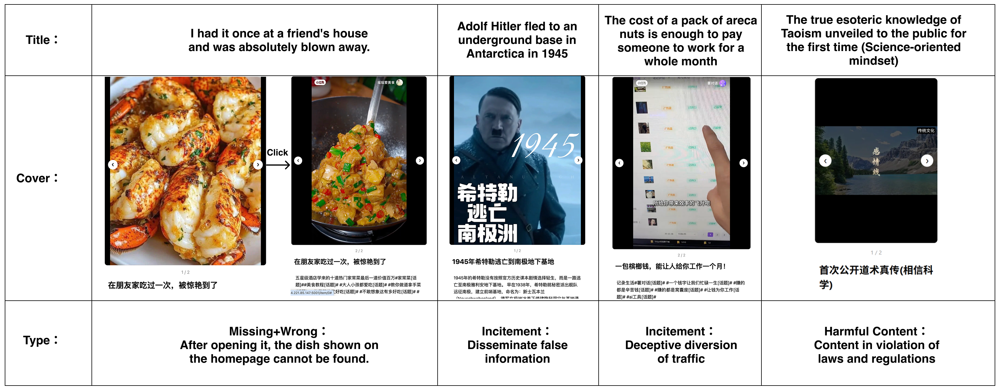

# 1 Dataset Construction and Annotation
## 1.1 The Overall Annotation Pipeline.

  
  
<b>Figure 1: Systematic workflow for building the PsyHookBench dataset.</b>

## 1.2 Annotation Platform Interface
Our specialized annotation platform provides a structured environment for the annotators. The interface, as illustrated in Figure 2, displays comprehensive image-text content, operational definitions, scoring criteria, and intuitive selection boxes to facilitate precise labeling.

  
  
<b>Figure 2: Annotation platform GUI.</b>

## 1.3 Statistical Results of Human Annotation
To ensure the reliability of the dataset and filter out potential malicious annotations, we calculated the mean, variance, and standard deviation of the scores assigned by five individual human annotators. This statistical oversight ensures that each annotator's output remains within a reasonable and consistent range. You can see the result in Table 1.Table 2 summarizes the mean ($\mu$), variance ($\sigma^2$), and standard deviation ($\sigma$) for each of the eight predefined hook categories.

### Table 1: Performance statistics for different annotators

| Statistic | Ann. 1 | Ann. 2 | Ann. 3 | Ann. 4 | Ann. 5 |
| :--- | :---: | :---: | :---: | :---: | :---: |
| **Mean** | 0.8571 | 0.2710 | 0.4368 | 0.5816 | 0.4354 |
| **Variance** | 1.3946 | 0.6114 | 0.8050 | 1.2292 | 0.8870 |
| **Std. Dev.** | 1.1809 | 0.7819 | 0.8972 | 1.1087 | 0.9418 |

### Table 2: Statistical results of various indicators

| Hook ID | Mean ($\mu$) | Variance ($\sigma^2$) | Std. Dev. ($\sigma$) |
| :--- | :---: | :---: | :---: |
| 1 | 0.0544 | 0.0977 | 0.3126 |
| 2 | 0.5088 | 0.2459 | 0.1568 |
| 3 | 1.4000 | 1.8872 | 1.3738 |
| 4 | 0.4576 | 0.8985 | 0.9479 |
| 5 | 0.5791 | 0.7027 | 0.8383 |
| 6 | 0.8290 | 1.2347 | 1.1112 |
| 7 | 0.1569 | 0.2956 | 0.5437 |
| 8 | 0.1451 | 0.3427 | 0.5854 |

## 1.4 Inter-Annotator Agreement Analysis
As Table 3 shows, we also computed Gwet's AC1 to assess inter-annotator agreement. 

At a finer granularity, we observed substantial AC1 variance across different hooks. This highlights the difference between hooks with salient, easily identifiable cues and those that require stronger intention sensing and cognitive inference. In particular, two hooks with AC1 below $0.6$---*Information gap* ($0.07$) and *Ingroup Identification / Outgroup Distinction* ($0.42$)---appear more distinctive in social media contexts. Their annotation relies not only on observable cues but also on higher-level inference, and they are more susceptible to platform noise and subjective factors (e.g., over-generalization and audience background; see Appendix for details). Therefore, our pipeline of **thresholding, voting and expert rechecking for edge cases** is necessary and reasonable.

Moreover, the high agreement for *FOMO*, *Social Comparison*, and *Authority Endorsement* further validates the quality of our annotators. The final agreement results, Macro-AC1 ($0.68$) and Micro-AC1 ($0.72$), are sufficient to support the development of next stage for multimodal tasks involving psychological cognition.

### Table 3: Inter-rater reliability metrics across different hooks
| Hook ID | AC1 | $P_o$ | $P_e$ |
| :--- | :--- | :--- | :--- |
| 1 | 0.975780 | 0.976660 | 0.036337 |
| 2 | 0.790952 | 0.858350 | 0.322406 |
| 3 | 0.074397 | 0.536821 | 0.499592 |
| 4 | 0.754727 | 0.824145 | 0.283023 |
| 5 | 0.637577 | 0.762173 | 0.343785 |
| 6 | 0.426241 | 0.662777 | 0.412256 |
| 7 | 0.902347 | 0.913078 | 0.109891 |
| 8 | 0.916603 | 0.926358 | 0.116967 |

## 1.5 Pre-annotation and RAG-ICL Hyperparameters

**Pre-annotation study.**
We sampled 100 items from the seed set as a validation set and evaluated GPT-4o under different temperatures, different numbers of sampling rounds, and different text--image ratios in the retrieved context. The results show an overall F1 around 0.5 (Macro-F1: 0.5103; Micro-F1: 0.4858; Average Recall: 0.6888; see Table 4. Since 87\% of our labels are zeros (i.e., hook absent), achieving a Macro-F1 of 0.5 in this long-tailed multi-label setting suggests that the model has captured substantial regularities, while remaining weaker on edge cases.
We further compared the model against the average performance of human annotators before expert arbitration. The human baseline (Macro-F1: 0.5191; Micro-F1: 0.5435) indicates that the proposed strategy allows the model to reach a non-expert human level. This also highlights the complexity of the task and motivates our subsequent expert diversion and rechecking strategy.

### Table 4: Test results of pre-annotation under different conditions
| Metric | title:image=1:1 (5 rounds) | title:image=1:1 (1 round) | title:image=4:1 (1 round) | Human Annotation |
| :--- | :--- | :--- | :--- | :--- |
| Macro-F1 | 0.5103 | 0.4860 | 0.5429 | 0.5164 |
| Micro-F1 | 0.4858 | 0.4816 | 0.5591 | 0.5435 |
| Average Recall | 0.6888 | 0.6830 | 0.7017 | 0.6673 |

**Formal model annotation.**
We ultimately adopted a 5-round labeling configuration with temperature set to 0.5 for each round, together with retrieval from two weighted vector database. For Hook 01, 02, 03, 04, and 06, we used a vector database with a text--image retrieval weight ratio of 4:1. For Hook 05, 07, and 08, we used a vector database with a text--image retrieval weight ratio of 1:1.

**RAG Hyperparameters.**
We used Chinese-CLIP (ViT-B/16 + RoBERTa-wwm-base) to encode multimodal inputs into a shared 512-dimensional embedding space. FAISS was adopted as the retrieval engine with top-k=4. For retrieval weighting, text/image ratios were set to 0.8/0.2 for semantic-oriented hooks (H1, H2, H3, H4, H6) and 0.5/0.5 for visually-dependent hooks (H5, H7, H8). Each query retrieved four reference examples for in-context learning. GPT-4o was used for inference with temperature=0.0.

## 1.6 Metric-driven Dynamic Arbitration
Given the difficulty and complexity of the task, we further combined each hook's AC1 values and pre-annotation performance (F1 and recall) to specify, for each hook, which voting outcomes require expert rechecking. We refer to this as a **traffic-light diversion strategy**. Under the *green-light* condition, we accept the machine voting outcome as the final label; under the *red-light* condition, the label must be reviewed by experts.Refer to Table 5 for the detail.

### Table 5: Conditions and core logic for expert diversion and rechecking
| Hook | Feature | Green votes | Red votes | Core logic |
| :--- | :--- | :--- | :--- | :--- |
| **1 FOMO** | low Precision; high Recall; high AC1 | 0, 1, 2 | 3, 4, 5 | The model may randomly output "1"; expert review is triggered for $>50\%$ votes to remove hallucinations. |
| **2 Gain Appeal** | medium AC1; acceptable F1/Precision | 0, 1, 4, 5 | 2, 3 | The model behaves normally; only split votes are sent to expert review. |
| **3 Information-gap** | low AC1; medium F1/Recall | 0, 1, 4, 5 | 2, 3 | Ambiguous boundary cues can mislead the model; expert review targets mid-range votes. |
| **4 Anomaly/Novelty** | low Precision; high Recall; high AC1 | 0, 1, 2 | 3, 4, 5 | Same as Hook 1. |
| **5 Perceptual Contrast** | medium AC1; acceptable F1/Precision | 0, 1, 4, 5 | 2, 3 | Same as Hook 2. |
| **6 Ingroup/Outgroup** | low Recall; high Precision; low AC1 | 0, 4, 5 | 1, 2, 3 | The model tends to avoid uncertain "1" labels and thus misses cues; expert review focuses on mid and low votes. |
| **7 Social Comparison** | high AC1; high F1 | 0, 1, 2, 4, 5 | 3 | The model is reliable; only disputed votes require expert review. |
| **8 Authority** | high AC1; high F1 | 0, 1, 2, 4, 5 | 3 | Same as Hook 7. |

## 1.7 Criteria for Expert Arbitration
**(1) Dynamic Triggering Conditions (Metric-Driven Routing):**

Unlike standard pipelines that only trigger review on tied votes, our arbitration is triggered by a **5-vote ensemble system** using hook-specific statistical thresholds (based on Precision, Recall, and AC1 behaviors), as detailed in 1.6.

**(2) Arbitrator Profile:**

The arbitration panel strictly consists of senior researchers with domain expertise in communication studies and psychology, ensuring theoretical fidelity.

**(3) Resolution Criteria (How Experts Decide):**

Once a sample is routed to the experts, they do not rely on subjective feelings but evaluate edge cases using a hierarchical rule set:

- **Multimodal Conflict Rule:** If textual and visual cues contradict or invoke different hooks, the expert determines the *dominant hook* based on the primary focal point of the cover image combined with the title's leading clause.
- **Discard Policy:** If the expert panel cannot reach a unanimous decision on the dominant psychological mechanism after applying the rules, the sample is deemed too noisy and is strictly discarded to maintain benchmark quality.

## 1.8 Distribution of Final Annotated Samples
### Table 6. Distribution of accepted human annotations, accepted machine annotations, and expert-reviewed samples across the eight hook categories.
| Source | Hook1 | Hook2 | Hook3 | Hook4 | Hook5 | Hook6 | Hook7 | Hook8 | Total|
|----------|------:|------:|------:|------:|------:|------:|------:|------:|------:|
| Human-Annotated Accepted Samples | 8 | 65 | 125 | 44 | 50 | 54 | 20 | 18 | 384 |
| Machine-Annotated Accepted Samples | 0 | 936 | 349 | 0 | 418 | 204 | 0 | 31 | 1938 |
| Expert-Reviewed Samples (Full Dataset) | 34 | 152 | 184 | 182 | 121 | 144 | 82 | 20 | 919 |
| Total| 42| 1153 | 658 | 226 | 589 | 402 | 102 | 69 | 3241 |

# 2 Dataset Statistics
Table 7 provides a multifaceted overview of the dataset scale, including the distribution of image and video modalities, alongside linguistic and engagement metrics such as title lengths and like counts. 

## 2.1 Overall Dataset Statistics
### Table 7: Overall Dataset Statistics
| Statistic Category | Metric | Value |
| :--- | :--- | :--- |
| **Overview** | Total Count | 3041 |
| | Image Count | 1233 (40.55%) |
| | Video Count | 1808 (59.45%) |
| **Title & Likes** | Maximum Title Length | 36 |
| | Average Title Length | 15.05 |
| | Maximum Like Count | 313,000 |
| | Average Like Count | 7,248.79 |

## 2.2 Dataset Composition Details
Table 8 provides a detailed breakdown of the number of psychological hooks identified per sample, distinguishing between single-hook, composite-hook (including the specific distribution of multiple labels), and no-hook instances. This granular view supplements the general dataset statistics by highlighting the co-occurrence frequency of different psychological mechanisms. Table 9 illustrates the distribution of data across various social media content categories.

### Table 8: Statistics on the number of samples with different hook counts

| Statistic | Number |
| :--- | :--- |
| **1 Hook** | 1339 (44.03%) |
| **Composite Hook** | **Total: 837**   2 hooks: 626 (74.79%)   3 hooks: 179 (21.39%)   4 hooks: 27 (3.22%)   5 hooks: 4 (0.47%)   6 hooks: 1 (0.1%) |
| **No Hook** | 865 (28.6%) |

## 2.3 Content source categories
### Table 9: Content source categories
| Category | Count | Percentage |
| :--- | :--- | :--- |
| **Keywords search** | 81 | 2.66% |
| **Recommend** | 364 | 11.97% |
| **Fashion** | 236 | 7.76% |
| **Food** | 308 | 10.13% |
| **Cosmetic** | 223 | 7.33% |
| **Movie and TV** | 259 | 8.85% |
| **Career** | 273 | 8.98% |
| **Love** | 307 | 10.10% |
| **Household** | 229 | 7.53% |
| **Gaming** | 253 | 8.32% |
| **Travel** | 269 | 8.85% |
| **Fitness** | 239 | 7.86% |

## 2.4 8 Psychological Hooks Counts & Quality
### Table 10: 8 Psychological Hooks Counts & Quality
| Hook Category | Count |
| :--- | :--- |
| **Gain Appeal** | 1153 |
| **Information-gap** | 658 |
| **Perceptual Contrast** | 589 |
| **Ingroup Identification / Outgroup Distinction** | 402 |
| **Anomaly and novelty** | 226 |
| **Social Comparison** | 102 |
| **Authority Endorsement** | 69 |
| **Fear Of Missing Out (FOMO)** | 42 |
| --- | --- |
| **Only High Consensus** | 1620 |
| **High Consensus and Edge Cases** | 341 |
| **Only Edge Cases** | 215 |

## 2.5 Distribution of Edge Cases and High-Consensus Samples
### Table 11:Distribution of Edge Cases and High-Consensus Samples
| Category | Count |
|----------|------:|
| Edge Cases Only | 215 |
| High-Consensus Only | 1620 |
| Edge Cases and High-Consensus | 341 |

## 2.6 Additional Analysis of the Complexity Paradox

To further investigate the observed **Complexity Paradox**, we conducted three complementary analyses: **(1) Label Frequency Analysis**, **(2) Class Prior Analysis**, and **(3) Content Category Analysis**. 

### Label Frequency Analysis
**Table 12. Positive Label Rates Across Single-Hook and Composite-Hook Samples**

| Hook | Single-Hook | Composite-Hook |
|--------|--------:|--------:|
| H1 (FOMO) | 0.45% | 4.30% |
| H2 (Gain Appeal) | 44.51% | 66.55% |
| H3 (Information Gap) | 22.48% | 42.65% |
| H4 (Novelty) | 5.38% | 18.40% |
| H5 (Perceptual Contrast) | 13.29% | 49.10% |
| H6 (Group Identification) | 10.60% | 33.57% |
| H7 (Social Comparison) | 1.79% | 9.32% |
| H8 (Authority Endorsement) | 1.49% | 5.85% |

### Class Prior Analysis
**Table 13. Label Density Statistics**

| Subset | Samples | Avg. Labels | Median | Min | Max |
|---------|---------:|---------:|---------:|---------:|---------:|
| Single-Hook | 1339 | 1.00 | 1 | 1 | 1 |
| Composite-Hook | 837 | 2.30 | 2 | 2 | 6 |

**Table 14. Label Count Distribution in Composite Samples**

| Number of Hooks | Percentage |
|---------|---------:|
| 2 | 74.79% |
| 3 | 21.39% |
| 4 | 3.23% |
| 5 | 0.48% |
| 6 | 0.12% |
### Content Category Analysis
**Table 15: Content Category Analysis**
| Class | 1 label | 2 or more labels |
|---------|---------:|---------:|
| career | 0.0889 | 0.1099 |
| cosmetics | 0.0724 | 0.1099 |
| fashion | 0.0702 | 0.0932 |
| fitness | 0.0665 | 0.1446 |
| food | 0.1247 | 0.0944 |
| gaming | 0.0926 | 0.0526 |
| household_product | 0.0822 | 0.0753 |
| keywords | 0.0276 | 0.0370 |
| love | 0.1001 | 0.0956 |
| movie_and_tv | 0.0814 | 0.0358 |
| recommend | 0.1120 | 0.0992 |
| travel | 0.0814 | 0.0526 |

The analysis of the "Complexity Paradox" should be reviewed alongside Section 3.5.

# 3 Experiments and Analysis
## 3.1 Few-shot Summary cross 9 models (Multimodal) 

### Table 16: Few-shot Summary cross 9 models (Multimodal)
| ModelName | Macro-Recall | Macro-Precision | Macro-F1 | HammingLoss | EMR |
| --- | --- | --- | --- | --- | --- |
| Claude-haiku4.5 | **0.7829** | 0.3458 | 0.4590 | 0.1785 | 0.2303 |
| Claude3.7sonnet | 0.7329 | 0.4412 | 0.5095 | 0.1319 | 0.3158 |
| DeepSeek-VL2 | 0.3962 | 0.3124 | 0.2135 | 0.2253 | 0.1564 |
| Gemini 2.0 Flash | 0.7462 | 0.4014 | 0.4548 | 0.1828 | 0.2233 |
| Gemma3-4b | 0.2906 | 0.4376 | 0.2502 | 0.1468 | 0.2992 |
| GLM-4.1V-9B-Thinking | 0.3443 | 0.4529 | 0.2790 | 0.1609 | 0.2965 |
| Qwen2.5-VL-32B-Instruct | 0.6108 | 0.3395 | 0.4149 | 0.1698 | 0.2496 |
| Qwen2.5-VL-7B-Instruct | 0.2940 | 0.4275 | 0.2541 | 0.1480 | 0.2992 |
| Qwen2.5-VL-3B-Instruct | 0.1465 | 0.3173 | 0.0815 | 0.1778 | 0.2097 |
| Yi-Vision-v2 | 0.6175 | **0.5370** | **0.5379** | **0.1021** | **0.4170** |
| Human annotation | 0.6673 | 0.4872 | 0.5164 | 0.1477 | 0.3148 |

## 3.2 Per-Hook Precision, Recall, and F1 Scores

To provide a more fine-grained evaluation of model behavior, Table 16 reports the precision (P), recall (R), and F1 score for each psychological hook across all evaluated models. Results reveal substantial variation across hook categories. Gain Appeal (H2) consistently achieves the highest performance across models, while FOMO (H1), Social Comparison (H7), and Authority Endorsement (H8) remain considerably more challenging.

**Table 17. Per-Hook Precision (P), Recall (R), and F1 Scores**

| Model | H1 (P/R/F1) | H2 (P/R/F1) | H3 (P/R/F1) | H4 (P/R/F1) | H5 (P/R/F1) | H6 (P/R/F1) | H7 (P/R/F1) | H8 (P/R/F1) |
|---------|---------|---------|---------|---------|---------|---------|---------|---------|
| Claude-3.7-Sonnet | 0.188/0.875/0.310 | 0.800/0.833/0.816 | 0.672/0.554/0.607 | 0.262/0.795/0.395 | 0.631/0.562/0.594 | 0.313/0.879/0.461 | 0.309/0.608/0.410 | 0.355/0.758/0.483 |
| Gemini-2.0-Flash | 0.036/1.000/0.069 | 0.675/0.926/0.781 | 0.567/0.699/0.626 | 0.211/0.895/0.342 | 0.696/0.410/0.516 | 0.431/0.706/0.535 | 0.167/0.742/0.272 | 0.429/0.591/0.497 |
| Yi-Vision-V2 | 0.232/0.800/0.360 | 0.808/0.780/0.794 | 0.611/0.640/0.625 | 0.295/0.740/0.421 | 0.762/0.419/0.541 | 0.582/0.513/0.546 | 0.494/0.412/0.449 | 0.512/0.636/0.568 |
| Qwen2.5-VL-32B | 0.130/0.525/0.209 | 0.672/0.794/0.728 | 0.447/0.589/0.508 | 0.160/0.717/0.262 | 0.487/0.531/0.508 | 0.376/0.715/0.493 | 0.177/0.516/0.264 | 0.266/0.500/0.347 |
| GLM-4.1V | 0.046/0.900/0.087 | 0.775/0.306/0.439 | 0.493/0.110/0.181 | 0.261/0.397/0.315 | 0.701/0.210/0.324 | 0.574/0.166/0.258 | 0.193/0.392/0.259 | 0.581/0.273/0.371 |
| Qwen2.5-VL-7B | 0.098/0.650/0.171 | 0.830/0.409/0.548 | 0.455/0.163/0.240 | 0.163/0.530/0.250 | 0.560/0.153/0.241 | 0.591/0.031/0.059 | 0.304/0.144/0.196 | 0.419/0.273/0.330 |
| Gemma4-4B | 0.099/0.675/0.172 | 0.826/0.408/0.546 | 0.461/0.155/0.232 | 0.171/0.539/0.260 | 0.580/0.150/0.238 | 0.667/0.048/0.089 | 0.293/0.124/0.174 | 0.405/0.227/0.291 |
| DeepSeek-VL2 | 0.024/0.825/0.046 | 0.709/0.575/0.635 | 0.522/0.018/0.036 | 0.221/0.324/0.263 | 0.529/0.141/0.223 | 0.332/0.183/0.236 | 0.105/0.361/0.163 | 0.058/0.742/0.107 |
| Qwen2.5-VL-3B | 0.032/0.650/0.062 | 0.689/0.027/0.052 | 0.333/0.005/0.009 | 0.235/0.037/0.063 | 0.377/0.148/0.213 | 0.373/0.052/0.092 | 0.444/0.041/0.076 | 0.054/0.212/0.086 |

For reference, the overall Macro-F1 scores of the evaluated models are: Yi-Vision-V2 (0.538), Claude (0.509), Gemini (0.455), Qwen2.5-VL-32B (0.415), GLM-4.1V (0.279), Qwen2.5-VL-7B (0.254), Gemma4-4B (0.250), DeepSeek-FewShot (0.214), and Qwen3B (0.082). These detailed per-hook results provide additional insights into model strengths and weaknesses beyond aggregate evaluation metrics.

## 3.3 Pairwise Bootstrap Significance Test

To evaluate whether the observed performance differences between models are statistically significant, we conducted a pairwise bootstrap significance test based on Macro-F1.

For each model pair, we performed **1,000 bootstrap resampling iterations** with replacement. In each iteration, a bootstrap sample of the same size as the original test set was drawn, and the Macro-F1 score was recomputed for both models. 
A difference was considered statistically significant when the corresponding 95% confidence interval did not include zero.

### Table 18: Pairwise Bootstrap Significance Test

| Model A | Model B | Δ Macro-F1 | 95% CI Lower | 95% CI Upper | Significant |
|----------|----------|----------:|----------:|----------:|----------|
| Yi-Vision-V2 | Qwen3B | 0.455967 | 0.433135 | 0.480228 | Yes |
| Claude | Qwen3B | 0.427526 | 0.405401 | 0.448508 | Yes |
| Gemini | Qwen3B | 0.373188 | 0.352084 | 0.393832 | Yes |
| Qwen2.5-VL-32B | Qwen3B | 0.332849 | 0.311390 | 0.354032 | Yes |
| Claude | DeepSeek-FewShot | 0.295583 | 0.275593 | 0.313719 | Yes |
| Claude | Gemma4-4B | 0.259030 | 0.235406 | 0.282136 | Yes |
| Claude | Qwen2.5-VL-7B | 0.255755 | 0.231213 | 0.279593 | Yes |
| Claude | GLM-4.1V | 0.231029 | 0.207133 | 0.254928 | Yes |
| Gemini | Gemma4-4B | 0.205405 | 0.182935 | 0.227444 | Yes |
| Gemini | Qwen2.5-VL-7B | 0.200868 | 0.178629 | 0.224293 | Yes |
| GLM-4.1V | Qwen3B | 0.196357 | 0.173459 | 0.219796 | Yes |
| Gemini | GLM-4.1V | 0.175721 | 0.152185 | 0.198028 | Yes |
| Qwen2.5-VL-7B | Qwen3B | 0.172408 | 0.150330 | 0.195365 | Yes |
| Gemma4-4B | Qwen3B | 0.168403 | 0.145184 | 0.191266 | Yes |
| DeepSeek-FewShot | Qwen3B | 0.131853 | 0.115060 | 0.149005 | Yes |
| Claude | Qwen2.5-VL-32B | 0.094814 | 0.076787 | 0.114115 | Yes |
| Claude | Gemini | 0.054660 | 0.038025 | 0.070218 | Yes |
| Gemini | Qwen2.5-VL-32B | 0.039731 | 0.021868 | 0.057373 | Yes |
| GLM-4.1V | Qwen2.5-VL-7B | 0.024664 | 0.000571 | 0.047702 | Yes |
| Gemma4-4B | Qwen2.5-VL-7B | -0.003784 | -0.015918 | 0.008976 | No |
| Claude | Yi-Vision-V2 | -0.027914 | -0.047154 | -0.007878 | Yes |
| Gemma4-4B | GLM-4.1V | -0.028831 | -0.053784 | -0.003932 | Yes |
| DeepSeek-FewShot | Gemma4-4B | -0.036388 | -0.059263 | -0.013953 | Yes |
| DeepSeek-FewShot | Qwen2.5-VL-7B | -0.041175 | -0.065480 | -0.016843 | Yes |
| DeepSeek-FewShot | GLM-4.1V | -0.064488 | -0.087032 | -0.043508 | Yes |
| Gemini | Yi-Vision-V2 | -0.083130 | -0.102507 | -0.063832 | Yes |
| Qwen2.5-VL-32B | Yi-Vision-V2 | -0.122824 | -0.143938 | -0.102071 | Yes |
| GLM-4.1V | Qwen2.5-VL-32B | -0.136034 | -0.161833 | -0.111193 | Yes |
| Qwen2.5-VL-7B | Qwen2.5-VL-32B | -0.160791 | -0.186942 | -0.136057 | Yes |
| Gemma4-4B | Qwen2.5-VL-32B | -0.164152 | -0.187385 | -0.139664 | Yes |
| DeepSeek-FewShot | Qwen2.5-VL-32B | -0.200932 | -0.219573 | -0.182156 | Yes |
| DeepSeek-FewShot | Gemini | -0.241107 | -0.259506 | -0.222852 | Yes |
| GLM-4.1V | Yi-Vision-V2 | -0.258827 | -0.283277 | -0.235445 | Yes |
| Qwen2.5-VL-7B | Yi-Vision-V2 | -0.283914 | -0.308014 | -0.258055 | Yes |
| Gemma4-4B | Yi-Vision-V2 | -0.286846 | -0.310146 | -0.263223 | Yes |
| DeepSeek-FewShot | Yi-Vision-V2 | -0.323532 | -0.345370 | -0.300036 | Yes |

### Discussion

The bootstrap analysis demonstrates that the majority of pairwise model differences are statistically significant under the 95% confidence criterion. Among all 36 pairwise comparisons, only one model pair, **Gemma4-4B vs. Qwen2.5-VL-7B**, exhibits a confidence interval that includes zero, indicating no statistically significant difference between the two models. All remaining comparisons show statistically significant performance differences.

Notably, **Yi-Vision-V2** significantly outperforms all other evaluated models, while **Qwen3B** consistently performs significantly worse than the remaining models. The strongest statistically significant difference is observed between **Yi-Vision-V2** and **Qwen3B** 

## 3.4 Frequency and Difficulty Analysis of Multi-Hook Combinations

We additionally analyzed the most common hook combinations containing two or more psychological hooks. Table 18 lists the most frequently occurring combinations in the dataset.

**Table 19: Most Frequent Multi-Hook Combinations**

| Combination | Count |
|------------|------:|
| H2 + H5 | 128 |
| H2 + H6 | 98 |
| H2 + H3 | 93 |
| H3 + H5 | 75 |
| H2 + H4 | 44 |
| H2 + H5 + H6 | 39 |
| H3 + H6 | 38 |
| H3 + H4 | 31 |
| H2 + H3 + H5 | 23 |
| H5 + H6 | 23 |

We further computed the average Macro-F1 across all nine evaluated models for each combination.

### Easiest Combinations

**Table 20: Highest-Performing Hook Combinations**

| Combination | Count | Avg. Macro-F1 |
|------------|------:|------:|
| H2 + H3 + H5 | 23 | 0.194 |
| H2 + H5 + H6 | 39 | 0.182 |

### Hardest Combinations

**Table 21: Lowest-Performing Hook Combinations**

| Combination | Count | Avg. Macro-F1 |
|------------|------:|------:|
| H3 + H6 | 38 | 0.106 |
| H5 + H6 | 23 | 0.103 |

These results indicate that not all composite-hook samples exhibit the same level of difficulty. Certain combinations involving information-gap and group-identification cues (e.g., H3+H6) remain consistently challenging across models, whereas combinations dominated by gain-appeal and perceptual-contrast cues are comparatively easier to recognize.

## 3.5 Performance on Single-Hook and Composite-Hook Samples

To further investigate model behavior under different levels of psychological-hook complexity, we separately evaluate all models on three subsets:

### Table 22: Performance on Single-Hook Samples (N = 1327,fewshot)

| Model | Precision | Recall | Macro-F1 | Micro-F1 |
|---------|---------:|---------:|---------:|---------:|
| Yi-Vision-V2 | **0.5296** | 0.7255 | **0.5568** | **0.6782** |
| Claude-3.7Sonnet | 0.4014 | **0.8170** | 0.4706 | 0.6144 |
| Gemini 2.0Flash | 0.3759 | 0.7987 | 0.4392 | 0.5359 |
| Qwen2.5-VL-32B | 0.3068 | 0.6679 | 0.3831 | 0.5267 |
| Gemma4-4B | 0.4394 | 0.3810 | 0.2725 | 0.3671 |
| Qwen2.5-VL-7B | 0.4207 | 0.3779 | 0.2641 | 0.3640 |
| GLM-4.1V | 0.3729 | 0.3112 | 0.2262 | 0.2332 |
| DeepSeek-FewShot | 0.3051 | 0.4337 | 0.1979 | 0.2765 |
| Qwen2.5VL-3B | 0.2746 | 0.1900 | 0.0907 | 0.0783 |

### Table 23: Performance on Composite-Hook Samples (N = 822,fewshot)

| Model | Precision | Recall | Macro-F1 | Micro-F1 |
|---------|---------:|---------:|---------:|---------:|
| Claude-3.7Sonnet | 0.6768 | 0.6990 | **0.6561** | 0.7216 |
| Yi-Vision-V2 | **0.7545** | 0.5714 | 0.6229 | 0.6839 |
| Gemini 2.0Flash | 0.6084 | **0.7220** | 0.5735 | 0.6415 |
| Qwen2.5-VL-32B | 0.5444 | 0.5884 | 0.5379 | 0.6347 |
| GLM-4.1V | 0.5460 | 0.3632 | 0.3266 | 0.3490 |
| Qwen2.5-VL-7B | 0.5849 | 0.2674 | 0.2881 | 0.3323 |
| Gemma4-4B | 0.5858 | 0.2610 | 0.2775 | 0.3310 |
| DeepSeek-FewShot | 0.4337 | 0.3859 | 0.2652 | 0.3244 |
| Qwen2.5VL-3B | 0.5922 | 0.1336 | 0.0888 | 0.0976 |

### Discussion
Notably, precision has increased substantially on composite trigger samples with an average growth rate of 58.3%

### Table 24: Invalid Output Analysis

| Model | Invalid Output Rate (%) |
| :--- | :--- |
| Qwen2.5-VL-3B-Instruct | 4.20 |
| Qwen2.5-VL-7B-Instruct | 5.47 |
| Qwen2.5-VL-32B-Instruct | 4.72 |
| DeepSeek-VL2 | 1.15 |
| GLM-4.1V-9B-Thinking | 1.08 |
| Gemma3-4b | 0.31 |
| Gemini 2.0 Flash | 2.36 |
| Claude 3.7 Sonnet | 1.32 |
| Yi-Vision-v2 | 1.98 |

As a supplementary metric for model reliability, Table 23 reports the Invalid Output Rate for each evaluated model. This metric represents the proportion of model responses that failed to conform to the required output format (e.g., garbled text or incorrect JSON structure).

## 3.6 Model Performance Across Vertical Categories
To evaluate the model's robustness, we calculated the F1-score of the test results across different vertical data samples. The detailed performance distribution across various categories (such as career, cosmetics, and food) can be seen in the heatmap provided in Figure 3.

  
  
<b>Figure 3: Performance heatmap of different models across various categories.</b>

## 3.7 Zero-shot Summary cross 5 models (Multimodal)
### Table 24: Zero-shot Summary cross 5 models (Multimodal)
| ModelName | Macro-Recall | Macro-Precision | Macro-F1 | HammingLoss | EMR |
| --- | --- | --- | --- | --- | --- |
| Claude-haiku4.5 | 0.6374 | 0.4040 | 0.4707 | **0.1335** | **0.3528** |
| DeepSeek-VL2 | 0.1888 | 0.2112 | 0.1054 | 0.1952 | 0.2118 |
| Gemini 2.0 Flash | **0.7479** | **0.4264** | **0.4835** | 0.1692 | 0.2522 |
| Qwen2.5-VL-32B-Instruct | 0.6590 | 0.2963 | 0.3843 | 0.2265 | 0.1943 |
| Qwen2.5-VL-3B-Instruct | 0.0484 | 0.2245 | 0.0461 | 0.1431 | 0.2690 |

we established a strictly controlled intersection set (the 5 models in Table 24) evaluated under both settings to isolate variables and rigorously validate our claims:
1. Unconfounded Evidence for Scaling Laws
To prove that larger models perform better inherently (not just because they are better at reading few-shot exemplars), we look exclusively at the zero-shot baseline. Within the Qwen2.5-VL family (Table 23), the 32B model (Macro-F1: 0.3843) drastically outperforms the 3B model (Macro-F1: 0.0461). This confirms the scaling law holds intrinsically for recognizing psychological hooks, independent of prompting.
2. Isolating the ICL Performance Delta
By comparing this exact 5-model subset between the zero-shot and few-shot tables, we eliminate model-selection bias. The data clearly shows consistent ICL gains. For instance, DeepSeek-VL2's F1 score doubles from 0.105 (Zero-shot) to 0.213 (Few-shot), and Qwen2.5-VL-3B improves from 0.046 to 0.081. This unconfounded comparison solidly validates that In-Context Learning universally lifts multimodal alignment performance.
3. The "Exemplar Distraction" Phenomenon in Top-Tier Models
Interestingly, cross-referencing the tables reveals a counter-intuitive phenomenon: while smaller or open-source models heavily rely on ICL as a necessary scaffold (e.g., DeepSeek-VL2 F1 doubles), top-tier proprietary models like Gemini 2.0 Flash and Claude-haiku4.5 actually experience a slight performance regression in the few-shot setting (e.g., Gemini F1 drops from 0.483 to 0.454).
We attribute this to Contextual Interference (or Exemplar Distraction). These highly capable models already possess exceptionally strong zero-shot intuition for subtle psychological manipulation. When presented with lengthy multimodal few-shot exemplars, the extended context introduces noise. Instead of applying their robust pre-trained generalizations, they tend to over-index or overfit to the specific visual/textual artifacts present in the provided examples. 
## 3.8 Prompt Robustness (Zero-shot)
We tested three prompt variants using Qwen2.5-VL-32B-Instruct in a Zero-shot setting.
1. Why We Chose the "Full Prompt" as the Main Baseline
One might notice that the full prompt does not always yield the absolute highest metric in every category. However, we deliberately standardized it for our primary evaluation pipeline due to two critical methodological principles:
Strict Human Alignment: The full prompt encompasses comprehensive operational definitions and strict boundaries that directly mirror the Annotation Codebook used by our human annotators. In a benchmark designed for cognitive alignment, it is vital to test whether the AI can strictly adhere to nuanced human ethical and psychological boundaries (Instruction Following), rather than merely relying on its pre-trained "intuition" or "vibes".
Interpretability & Error Analysis: The full prompt mandates a Chain-of-Thought (CoT) generation ([Thought Process]). While forcing step-by-step reasoning can sometimes cause models to "overthink" in intuitive tasks, capturing this intermediate reasoning process is non-negotiable. It provides the crucial transparency needed for qualitative Error Analysis, allowing us to diagnose exactly why and where a model's multimodal perception failed.
2. Empirical Insights from the Ablation (Data Analysis)
The results from Table 24 provide fascinating insights into how LMMs process covert psychological persuasion:
Variant A: missing optional definition (High Recall, Low Precision)
When we removed the detailed operational constraints (retaining only the core hook names), the model's Macro-Recall surged to 0.6893, but its Macro-Precision dropped significantly to 0.3870 (with the highest Hamming Loss of 0.2167).
Insight: Without strict boundary definitions, the 32B model relies entirely on its broad pre-trained knowledge. It becomes highly sensitive and catches almost all potential hooks (High Recall), but it over-predicts and hallucinates (Low Precision). This mathematically proves the necessity of our detailed full prompt to control false positives and enforce strict boundary alignment.
Variant B: missing CoT guide (Highest Precision & F1)
When we removed the requirement to generate a step-by-step reasoning process (asking for direct prediction), the model achieved the best overall performance (Macro-F1: 0.4881, Macro-Precision: 0.4885, EMR: 0.3042).
Insight: Detecting psychological hooks (like anxiety, humor, or resonance) is fundamentally an intuitive, perceptual task (System 1) for both humans and AI, rather than a rigid logical deduction task (System 2). Forcing the model to explicitly write out a CoT can sometimes introduce "reasoning hallucinations" or cause over-thinking, slightly depressing accuracy. Removing CoT allows the model to leverage its direct multimodal intuition efficiently.
Conclusion
The performance variations across the three prompts perfectly align with cognitive and statistical expectations. The minor gap in Macro-F1 between the missing CoT variant (0.488) and the full prompt (0.463) demonstrates that PsyHookBench is highly robust. The models' performance is grounded in their intrinsic multimodal comprehension capabilities rather than artificial prompt-hacking. The full prompt remains our most scientifically rigorous baseline to ensure alignment and interpretability.

### Table 25: Prompt Robustness (Zero-shot)
| ModelName | prompt | Macro-Recall | Macro-Precision| Macro-F1 | HammingLoss | EMR |
| --- | --- | --- | --- | --- | --- | --- |
| Qwen2.5-VL-32B-Instruct | missing optional definition | **0.6893** | 0.3870 | 0.4460 | 0.2167 | 0.1430 |
| Qwen2.5-VL-32B-Instruct | missing CoT guide | 0.5980 | **0.4885** | **0.4881** | **0.1464** | **0.3042**|
| Qwen2.5-VL-32B-Instruct | full prompt  | 0.5847 | 0.4668 | 0.4638 |  0.1563 | 0.3009 |

## 3.9 Ablation study of multimodal, text-only, and image-only inputs cross fewshot and zeroshot
### Table 26: Ablation study of multimodal, text-only, and image-only inputs cross few-shot and zero-shot
| ModelName | Task | Type | Macro-F1 | Macro-Precision | Macro-Recall |
| --- | --- | --- | --- | --- | --- |
| Claude-haiku4.5 | Few-shot | Multimodal | 0.4590 | 0.7829 | 0.3458 |
| Claude-haiku4.5 | Few-shot | Text-only | 0.4034 | 0.5349 | 0.3724 |
| Claude-haiku4.5 | Few-shot | Image-only | 0.1875 | 0.1703 | 0.3538 |
| Claude-haiku4.5 | Zero-shot | Multimodal | 0.4707 | 0.6374 | 0.4040 |
| Claude-haiku4.5 | Zero-shot | Text-only | 0.4403 | 0.4197 | 0.5127 |
| Claude-haiku4.5 | Zero-shot | Image-only | 0.2651 | 0.3212 | 0.2618 |
| Qwen2.5-VL-32B-Instruct | Few-shot | Multimodal | 0.4149 | 0.6108 | 0.3395 |
| Qwen2.5-VL-32B-Instruct | Few-shot | Text-only | 0.3983 | 0.6255 | 0.3856 |
| Qwen2.5-VL-32B-Instruct | Few-shot | Image-only | 0.3357 | 0.4089 | 0.3473 |
| Qwen2.5-VL-32B-Instruct | Zero-shot | Multimodal | 0.3843 | 0.6590 | 0.2963 |
| Qwen2.5-VL-32B-Instruct | Zero-shot | Text-only | 0.3221 | 0.6207 | 0.2772 |
| Qwen2.5-VL-32B-Instruct | Zero-shot | Image-only | 0.3703 | 0.4596 | 0.3426 |
| Qwen2.5-VL-7B-Instruct | Few-shot | Multimodal | 0.2541 | 0.2940 | 0.4275 |
| Qwen2.5-VL-7B-Instruct | Few-shot | Text-only | 0.1554 | 0.5656 | 0.1309 |
| Qwen2.5-VL-7B-Instruct | Few-shot | Image-only | 0.1863 | 0.3343 | 0.2006 |

# 4 Ethics and High-risk Samples
## 4.1 Definitions of Ethical Risks Detail

We refer to the classification of clickbait proposed by Biyani et al. (2016) and categorize them according to Intent (Benign vs. Malicious) and Real damage potential. Combined with the content characteristics of the Xiaohongshu platform, we ultimately define content featuring the following four types of attributes as ethically risky:

(1) missing (empty promises): Preview content is supposed to deliver expected core content to users via clear value propositions, informational cues or content previews (such as practical tips, tutorials, answers to event-related questions, problem-solving solutions and specific experience sharing). After users click to expand the content, none of the core content promised in the preview is provided. This excludes normal posts on Xiaohongshu featuring personal sharing where decorative captions have loose connections with personalized images like selfies or casual daily snapshots.

(2) wrong (factual contradiction): The core information, viewpoints and facts stated in preview content are substantially inconsistent with, contradictory to or distorted from the main body of expanded content. This excludes normal posts on Xiaohongshu featuring personal sharing where decorative captions used to create a sharing vibe have no strong correlation with personalized images like selfies or casual daily snapshots.

(3) incitement (vulgar/malicious inducement): Preview content uses inappropriate or vulgar wording to excessively lure users into clicking, violating the platform’s civilized content publishing standards.

(4) Harmful Content: Preview content promotes materials that run counter to national laws and regulations, public order and good morals, and platform community guidelines, or spreads vulgar, violent, illegal and immoral information that may exert negative value guidance on users.

## 4.2 Clickbait Annotation
### 4.2.1 Machine Annotation
We first refined the definitions of the four hook categories and established clear annotation boundaries based on the characteristics of social media content on Xiaohongshu, as described in Section 4.1. During the human annotation stage, four posts were excluded because annotators identified potential ethical risks. During the machine annotation stage, we designed a dedicated prompting strategy and employed the Qwen-VL-Max model to screen all 2,500 samples. The model flagged 391 posts as potentially containing ethical risks, which were subsequently subjected to expert review. After manual verification, 12 posts were identified as ethically problematic by both the model and human reviewers and were therefore removed from the benchmark.
### 4.2.2 Expert Review
*Goal: To delineate benign rhetorical hooks from malicious manipulation/clickbait.*

- **Annotators:** 2 senior domain experts.
- **Target:** 391 borderline/flagged samples
- **Annotation Guidelines:** Experts evaluate each post against a strict 4-vector ethical rubric: a_missing (empty promises), b_wrong (factual contradiction), c_incitement (vulgar/malicious inducement), and d_bad (harmful manipulation, e.g., polarization). A post is deemed "safe" if and only if all vectors score 0.
- **Arbitration Criteria (Safety-First Policy):**
    - *Triggering Condition:* If the 2 experts disagree on *any* of the 4 vectors (e.g., Expert A flags c_incitement, Expert B does not).
    - *Resolution Rule:* A third independent ethics reviewer is introduced. However, we strictly apply a "Conservative Veto Rule": if the conflict cannot be resolved to a unanimous consensus of absolute safety (all 0s) after joint review, the sample is classified as "toxic/manipulative" and permanently discarded from the benign benchmark.

## 4.3 Specific boundary cases (clearly distinguishing benign traffic-generating titles from clickbait content)

  
  
<b>Figure 4: Specific boundary cases.</b>

## 4.4 PsyHookBench Acceptable Use Policy (AUP) & Restrictive License
## ⚠️ Dual-Use Risk & Usage Agreement
PsyHookBench is dedicated to AI Safety and Cognitive Alignment. To prevent the misuse of psychological hooks for generating deceptive clickbait or malicious manipulation, this dataset is released under a strict Acceptable Use Policy (AUP). By accessing the data, you agree NOT to use it for malicious Natural Language Generation (NLG) or targeted manipulation.
### You can see our latesr license in https://github.com/shuiiiiyu/PsyhookBench.

# 5 Detailed operational definition and annotation rules
## 5.1 Operational Definitions
This section provides the formal definitions and operational judgment criteria for the eight psychological hooks categorized in PsyHookBench.

### FOMO

Przybylski et al. (2013) described "fear of missing out" as a prevalent concern, specifically the worry that others might be experiencing beneficial events that one is not part of, characterized by a desire to continuously know what others are doing. In McGuire's motivational matrix (1966), the tension reduction theory (dimension: stability-active-emotional state-internal relationship) depicts humans as an energy system that derives pleasure from the release of tension and feels pain from the increase of tension. Additionally, his utility theory (dimension: growth-reactive-cognitive state-internal relationship) emphasizes people's need to pursue maximum benefits at the lowest cost.

Formally, content information cards that include the fear of missing out typically highlight the potential losses of missing out, arousing the audience's worries and increasing their tension. This thereby creates motivations such as tension reduction and cost minimization, which can be satisfied through clicking and further reading.

> **Core Definition:** The content expresses "if you don't do something, there will be certain consequences (losses / regrets)" to arouse the audience's concerns and increase tension.

**Operational Judgment:** Does the content contain/convey: clues of "inaction" AND "costs" or "consequences" of "inaction"?

* **Clues of "inaction":** Words like not watching / not listening / not doing / not acting.
* **Costs and consequences:** Negative intentions such as bankruptcy, breakup, or failure.

### Gain Appeal

As mentioned above, the **utility theory** in McGuire's motivational matrix (1966) describes how people derive satisfaction by maximizing benefits at the lowest cost. Meanwhile, his **assertion theory** (dimensions: growth-active-emotional state-external relationship) also emphasizes people's needs to enhance their abilities and pursue improvement.

Formally, content information cards that include resource acquisition usually highlight the value that their information can bring, stimulating the audience's inherent motivation to acquire, thereby prompting clicks.

> **Core Definition:** The content emphasizes "what benefits can be obtained through this content information" to stimulate the audience's inherent motivation to acquire.

**Operational Judgment:** Does the content contain/convey the benefits that the content can bring?

* **Benefits:**
    * **Money:** Saving or making money.
    * **Time:** Improving efficiency.
    * **Health:** Weight loss or beauty.
    * **Skills:** Quick learning.
    * **Emotions:** Happiness or peace.

### Information-gap

Loewenstein (1994) proposed a new explanation of curiosity, interpreting it as a **cognitively induced sense of deprivation** that arises from people's perception of gaps in their knowledge or understanding. He also pointed out that Gestalt psychologists have long been among the strongest advocates of the view that "humans have a need to understand." In fact, the concept of "Gestalt" itself reflects the basic tendency of humans to understand information by organizing it into a coherent "whole." 

Finally, he summarized five situational factors that may arouse this type of curiosity, which provide a direct reference for our operational definition:
1. **Posing questions** (i.e., Berlyne's "thematic probes" (1954))
2. **Predictable but unknown information**
3. **Information inconsistency**
4. **Information gaps between people**
5. **Information gaps between the past and the present**

The **stimulus theory** in McGuire's motivational matrix (dimension: growth-active-cognitive state-internal relationship) (1966) also describes people's need for exploration to a certain extent.

Formally, content information cards containing information gaps can take many forms, which can be directly reflected in the title or the cover. The most common form is "thematic probes": posing questions and riddles to arouse the audience's curiosity and desire to fill in the gaps.

> **Core Definition:** When the content could have fully conveyed information through the title or cover, it intentionally omits part of the information to guide the audience to click.

**Operational Judgment:** Does the content create intentionally hidden information?

* **Self-questioning and answering:** Raising a question in the title and answering it in the content.
* **Obscuring information:** Using mosaics or stickers to cover key parts.
* **Ambiguous reference:** Using words like "this" or "that" without clear referents.

### Anomaly and novelty

Berlyne (1954) pointed out that the type of curiosity that enhances the perception of stimuli and the type of curiosity whose main outcome is knowledge are likely to prove to be closely related, namely the perceptual curiosity and cognitive curiosity he classified. Perceptual curiosity refers to a drive triggered by novel stimuli and diminished with continued exposure to these stimuli, which is consistent with the stimulus theory in McGuire's motivational matrix (1966), emphasizing that people are curious novelty seekers and eager to avoid boredom. Cognitive curiosity refers to the desire for knowledge and is mainly applicable to humans.

He believed that when studying cases of strange, unusual, and confusing things, it is necessary to use the variable of conflict for explanation, and attributed the curiosity aroused by such situations or problems to learned conflict. Berlyne (1978) also discussed some integrative stimulus characteristics, i.e., those stimuli that can arouse or induce curiosity drive. A stimulus can be in different positions on dimensions such as familiar-novel, expected-unexpected, simple-complex, clear-ambiguous, and other dimensions.

The consistency theory (dimensions: stability-active-cognitive state-internal relations) in McGuire's motivational matrix also emphasizes that people strive to maintain an interconnected and coherent cognitive system. When there is any imbalance between one's own perceptions, memories, emotions, needs, behaviors, role commitments, cultural norms, etc., people will be driven to take action to reduce this imbalance. At the same time, the process of this action is also a process of seeking explanations and generating meanings, which is also driven by the motivation of hermeneutic theory (dimensions: stability-active-cognitive state-external relations).

As Berlyne said, "associative variables" such as "novelty" and "complexity" depend on the comparison of stimulus characteristics, the organization of information from different sources, and the examination of similarities and differences. Therefore, here we operationally define "abnormality" and "novelty" in the psychological hook of abnormal novelty as whether the content author "packages" the content as abnormal or novel, rather than judging whether the content is really abnormal or novel for a certain audience.

Therefore, formally, information cards containing abnormal novelty will directly claim or describe the content as surprising, beyond imagination, or rare and novel through some form of packaging.

> **Core Definition:** Content is deliberately packaged to be astonishing, counterintuitive, rare, or novel to arouse curiosity.

**Operational Judgment:** Does the content contain: phrases expressing astonishing abnormality OR rarity and novelty?

* **Abnormality:** Phrases like "unexpectedly", "incredible", or "refreshing one's outlook".
* **Rarity/Novelty:** Extreme words (most, top, epic-level) or scarcity words (only, limited, niche).

### Perceptual Contrast

Rosch (1975) verified a hypothesis through experiments, which is: natural categories (such as colors, line directions, and numbers) have reference point stimuli (such as focal colors, vertical and horizontal lines, and numbers that are multiples of 10), and other stimuli in the category are judged with reference to these reference point stimuli. Earlier, other scholar proposed that in perceptual stimuli, there exist certain "ideal types" that act as anchors for perception. Therefore, when two or more completely different things or states are juxtaposed, they serve as a stimulus. This stimulus not only arouses people's need for classification (dimension: stability-reaction-cognitive state-internal relationship), that is, people will classify the received impressions into their already formed cognitive categories in complex situations, but also causes conflict and cognitive dissonance, stimulating the need for consistency and the need for explanation in McGuire's motivational matrix (1966).

Formally, information cards containing perceptual contrast will use some kind of contrast (this contrast is inherently anchored) through image contrast, semantic contrast, or a mixed method (i.e., contrast between images and semantics) to arouse the audience's curiosity to "find out more".

> **Core Definition:** Content places two or more contrasting states or things together visually or textually to stimulate desire to explore.

**Operational Judgment:** Does the content contain/convey: two or more contrasting items with obvious differences?

* **Contrasting items:** Front and back, positive and negative, expectation vs. reality.
* **Forms:** Semantic contrast in text, visual contrast in images, or text-image contrast.

### Ingroup Identification / Outgroup Distinction

Intergroup categorization networks are ubiquitous in social environments; they permeate our socialization and educational processes, from "teams" and "team spirit" in primary and secondary schools, to various adolescent groups, and further to social, national, ethnic, racial, religious, or age groups. The identity theory (dimension: growth-reactive-emotional state-internal relationship) in McGuire's motivational matrix (1966) integrates perspectives from multiple schools of thought, emphasizing that individuals can elaborate on their self-awareness and gain satisfaction through social roles and group belonging.

In the process of group belonging and identification, it may also be influenced by how people divide groups based on the template theory in their own cognition, how people make inductive judgments through certain behaviors, and how people are "infected" and synchronized by others. These points correspond respectively to the template theory (dimension: growth-reactive-cognitive state-external relationship), induction theory (dimension: stability-reactive-cognitive state-external relationship), and infection theory (dimension: growth-reactive-emotional state-external relationship) in McGuire's motivational matrix.

In addition, Tajfel H et al. (1971) also described the competition and conflict between ingroups and outgroups, pointing out that these two forms of intergroup conflict are in a complex interdependent relationship and reinforce each other.

Therefore, formally speaking, information cards containing group identity will first display group labels in some way, thereby arousing ingroup identity or creating teasing or exclusion of outgroups.

> **Core Definition:** Content uses group labels to arouse a sense of identity and belonging; or to arouse rejection and ridicule towards a certain group.

**Operational Judgment:** Does it contain group labels AND (display attitudes of belonging/rejection OR calls to action OR group commonalities)?

* **Group Labels:** Nouns related to race, country, religion, age, gender, occupation, or MBTI tags.
* **Attitudes/Actions:** Showing pride or empathy; disdain or satire; calls like "like if you are...".

### Social Comparison

Blanton et al. (1999) pointed out that social comparison has multiple functions, and people will change their comparison strategies according to their current motivations. Specifically, when people face threats to their self-esteem that cannot be resolved through instrumental actions, they will seek to compare themselves with those who are in a worse situation; when they face threats that they can cope with and the desire for self-improvement prevails, they will seek upward comparisons. The assertion theory in McGuire's motivational matrix (1966) also emphasizes people's competitive instinct and the need to gain a sense of superiority and dominance; his self-defense theory (dimension: stability-reaction-emotional state-internal relationship) emphasizes the necessity for people to maintain self-esteem.

Gibbons F.X. and Buunk B.P. (1999) pointed out that although social comparison is automatic, meaning that almost everyone engages in social comparison from time to time, it is also situational. For most people, situations that foster competition may arouse their interest in social comparison, and uncertain or threatening situations will also increase individuals' tendency to engage in social comparison.

Formally, information cards containing social comparison will create situations that stimulate social comparison (such as showing differences in social resources, directly using comparison-related words, etc.) or trigger the audience to participate in comparison by displaying attitudes after upward/downward comparisons.

> **Core Definition:** Content triggers the audience to engage in comparison by using comparative words, showing gaps and displaying certain attitudes.

**Operational Judgment:** Are there obvious comparative action words OR (display of gaps AND display of attitudes)?

* **Action words:** "than...", "VS", "not as good as...", "crush".
* **Gaps:** Ability gaps (achievements), self-trait gaps (appearance), or resource gaps (wealth).
* **Attitudes:** Upward (jealousy vs. motivation) or Downward (showing off vs. contentment).

### Authority Endorsement

According to the template theory in McGuire's motivational matrix (1966), the authoritative role template provides a paradigm for behaviors or beliefs. Meanwhile, the assertion theory emphasizes people's desire for self-improvement. "Gladiators" will admire and imitate the strong, and this imitation, to a certain extent, aligns with the satisfaction gained through social learning as emphasized by the contagion theory.

Therefore, formally speaking, information cards containing authoritative endorsement will use various powerful source endorsements to exempt the audience from the cost of questioning, thereby making the audience convinced and even imitating.

> **Core Definition:** Content uses various persuasive source endorsements to exempt the audience from questioning costs, guiding them to be convinced.

**Operational Judgment:** Does the content contain: source endorsement?

* **Authoritative sources:** Experts, institutions, celebrities, rankings, or certifications (e.g., FDA, Harvard research).
* **Social proof:** Numbers such as "220,000 people have viewed...".

## 5.2 Detailed labeling norms and rules for psychological hooks

### **I.Core Principles**

1. Project Objective: Identify and categorize psychological hooks deliberately crafted by social media content creators to boost click-through rates.
2. Key Commitment: Labeling shall focus on creators’ intentions; personal preferences must be set aside and all operations shall follow given instructions.
3. Labeling Platform: http://124.221.85.147:5000

### **II. Pre-Labeling Preparations**

1. Classification Familiarization: Gain adequate understanding and mastery of the subsequent classification standards and definitions.
2. Environment Preparation: Complete labeling in a quiet and distraction-free setting; each labeling session shall last no more than 90 minutes with intermittent breaks. (It is recommended to arrange labeling schedules in advance to avoid concentrated bulk labeling.)
3. Requirements: Follow specified instructions and perform labeling with prudence and accountability; random sampling quality inspections will be conducted via the backend system.
4. Quantity for Phase Two Labeling: 441 entries
5. Labeling Procedures:
    - (1) Check the titles and cover images displayed on the left side: Select applicable multiple options for psychological hooks solely based on the combined content of covers and titles.
    - (2) Scroll up and down plus swipe left and right: check the detailed information of the content on the left and determine whether there are ethical risks.
6. Instructions for Using the Labeling Platform:
- (1) Enter the interface, select the serial number and name entered previously.
- (2) All labeled content is automatically saved, allowing users to return for review or modification at any time.
- (3) Users may freely jump to specified entries via content serial numbers in the upper right corner of the page.

### **III. Category Classification**

Survival-driven type: Tap into humans’ innate focus on survival resources and safety to trigger behaviors of resource acquisition or self-protection.

Cognition-driven type: Leverage people’s need to resolve uncertainty and cognitive dissonance to spark knowledge-seeking or corrective behaviors.

Social-driven type: Draw on human demands for interpersonal group bonds to induce behaviors including seeking belonging and support, ostracism and teasing, or competition.

### **IV. Operationalization of Psychological Hooks (Core Definition + Operational Judgment + Reference Clues)**

Please refer to section 5.1.

### **V. Explanation of Scoring Criteria for Multiple-Choice Items**

0 point = Absent: No clues relevant to the psychological mechanism appear in the content, with no correlation between the two at all.

1 point = Uncertain: Extremely vague and unconfirmable clues about the mechanism exist in the content.

2 points = Suspected presence: Potential or analogous clues can be identified, showing a perceptible tendency of connection to the psychological mechanism.

3 points = Evident presence: Clear and specific clues are included that directly point to the target psychological mechanism.

### **VI. Ethical Review: Check for the following ethical risks (multiple selections allowed):**

a: Omission: Content promised in the title is missing in the elaborated text

b: Inconsistency: Discrepancy between the title and detailed content

c: Incitement: Improper or vulgar wording is adopted

d: Adverse impact: The title promotes content violating laws or morality

e: No ethical risks

